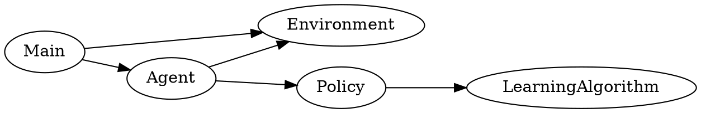

# Purpose

Convert the repository analysis into a simplified architectural representation of the Java codebase.

The source code is located at:

`C:\JavaCode\relexp-java`

# Instructions

Use the repository map from the previous analysis and inspect important source files in more detail.

Identify approximately 5–15 major nodes that best explain the codebase.

A node may represent:

- a package
- a subsystem
- an important class
- an interface
- an application entry point
- an external dependency or system

Prefer packages or subsystems over individual classes when the codebase is large.

Only show individual classes when they are particularly important for understanding execution or architecture.

# Analyze relationships

Identify important relationships such as:

- calls
- uses
- creates
- implements
- extends
- delegates to
- reads from
- writes to
- supplies data to
- depends on

Do not show every method-level dependency.

Focus on relationships that help explain how the system works.

# Java-specific analysis

Pay particular attention to:

- package structure
- interfaces and implementations
- inheritance
- composition
- factories
- dependency injection
- controllers
- services
- repositories
- domain models
- configuration classes
- application entry points
- important algorithms

If Maven or Gradle dependencies materially affect the architecture, include only the important ones.

# Diagram abstraction

Group related components together.

Prefer a structure such as:

Entry point
→ orchestration
→ core logic
→ supporting components

or another structure that accurately represents the codebase.

Do not force a layered architecture if the code does not actually use one.

# Intermediate representation

Create a simplified diagram specification suitable for Graphviz.

Prefer Graphviz DOT.

Example:

